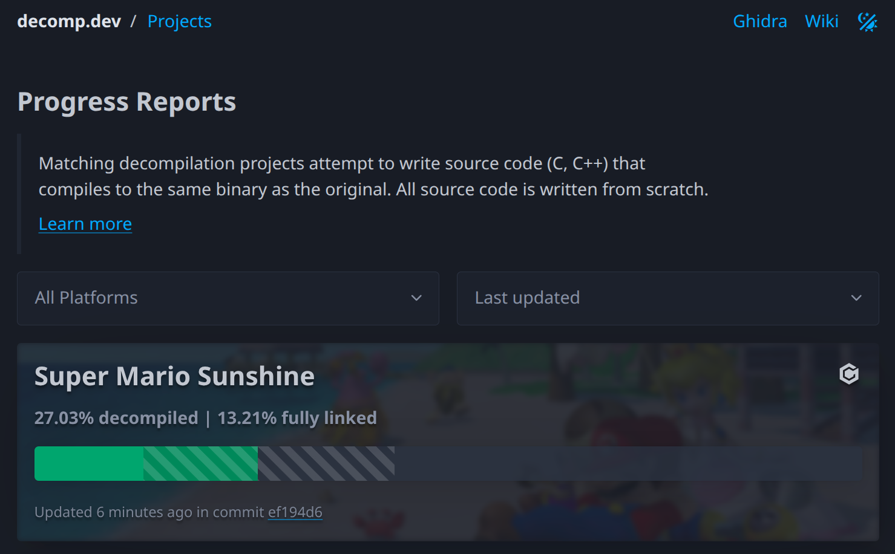
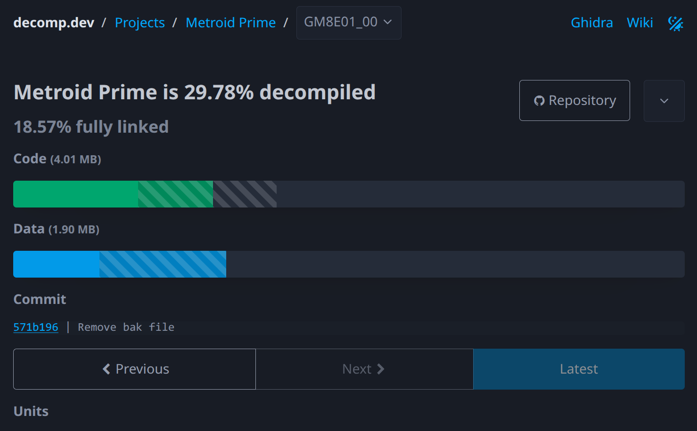

I build tools for decompilation and game reverse engineering, with a focus on GameCube and Wii.

<a href="https://github.com/encounter">GitHub</a> &middot; <a href="https://discord.com/users/130490603749376000">Discord</a>

# Projects

RustTypeScript

## [objdiff](https://github.com/encounter/objdiff)

Local diffing tool for decompilation projects

`objdiff` compares object files across functions and data. It supports ARM, ARM64, MIPS, PowerPC, SuperH, and x86(-64), and provides a GUI, TUI, and JSON output for integration with other tools and agentic workflows.

The core diffing engine compiles to WASM and runs as a [web frontend](https://github.com/encounter/objdiff-web) in [decomp.me](https://decomp.me) and as a [VS Code extension](https://marketplace.visualstudio.com/items?itemName=decomp-dev.objdiff). Its progress reporting system powers [decomp.dev](https://decomp.dev).

Inspired by <a href="https://decomp.me">decomp.me</a> and <a href="https://github.com/simonlindholm/asm-differ">asm-differ</a>.

Rust

## [decomp.dev](https://decomp.dev)

Progress hub for decompilation projects

`decomp.dev` tracks progress for more than 80 decompilation projects. With data driven by `objdiff`'s progress reports, it provides granular information down to individual translation units and functions, plus a tree view for exploring project structure. Projects can categorize units, track multiple game versions, and navigate full commit-by-commit history.

All of this information is also exposed through its API, along with a badge system for embedding live progress in project `README`s.

Written in Rust with Axum.

C++

## [wibo](https://github.com/decompals/wibo)

Lightweight Win32 binary loader for Linux and macOS

`wibo` runs 32-bit Windows command-line tools with minimal overhead. It implements a substantial portion of the Win32 API: file I/O, threading, heap management, DLL loading, TLS, and async I/O with platform-specific backends (io_uring, epoll, kqueue). On 64-bit hosts, it constrains the guest address space to the lower 2GB and bridges calling conventions with generated trampolines. Runs on macOS under Rosetta 2.

Used by <a href="https://decomp.me">decomp.me</a> to run Windows compilers in containers.

Rust

## [decomp-toolkit](https://github.com/encounter/decomp-toolkit)

PowerPC static analyzer, binary delinker, and GameCube/Wii swiss army knife

`decomp-toolkit` takes a compiled binary and produces fully relinkable objects. Its analyzer handles function and object boundary detection, signature analysis, and rebuilding relocations, all with minimal configuration. <a href="https://github.com/encounter/dtk-template">dtk-template</a> is a project template and build system built on top of decomp-toolkit.

Its approach to matching decompilation has since been applied to other platforms, including [ds-decomp](https://github.com/AetiasHax/ds-decomp) for Nintendo DS and [jeff](https://github.com/rjkiv/jeff) for Xbox 360.

Used by more than 50 decompilation projects, including several now-complete ones like <a href="https://github.com/zeldaret/tp">The Legend of Zelda: Twilight Princess</a> and <a href="https://github.com/mariopartyrd/marioparty4">Mario Party 4</a>.

Rust

## [nod](https://github.com/encounter/nod)

GameCube and Wii disc image Rust library and CLI tool

`nod` supports reading and converting all GameCube and Wii disc image formats, with a simple and performant API. Open any disc image and get a `Read + Seek + BufRead` handle. Converting to ISO is just reading from that handle and writing to a file, regardless of the source format. Open a partition and get the same interface, transparently handling Wii encryption and hashing.

Reading and writing are both multithreaded, and `nod` produces smaller disc images faster than both Dolphin and NKit v2. C bindings are available for FFI.

Used by <a href="https://github.com/mq1/TinyWiiBackupManager">TinyWiiBackupManager</a>.

Rust

## [powerpc-rs](https://github.com/encounter/powerpc-rs)

PowerPC disassembler and assembler in Rust

`powerpc-rs` is driven by a declarative instruction set definition that is compiled into Rust at build time, similar to LLVM's TableGen. It supports the full PowerPC instruction set along with Gekko/Broadway paired singles (GameCube/Wii) and Xenon VMX128 (Xbox 360) extensions.

The disassembler has been fuzzed over all 4.29 billion possible 32-bit instruction values and runs at ~275M instructions per second.

Used as the PowerPC backend for objdiff and decomp-toolkit.

GoJava

## [ghidra-panel](https://github.com/encounter/ghidra-panel)

Self-service portal for managing access to shared Ghidra repositories

`ghidra-panel` integrates with Ghidra Server through an in-process gRPC plugin, allowing repository administrators to manage users and permissions. Users authenticate with Discord and can request repository access, sending a notification with a one-click approval link for admins.

Powers the collaboration infrastructure on <a href="https://decomp.dev">decomp.dev</a>.

C++

## [aurora](https://github.com/encounter/aurora)

Source-level GameCube & Wii compatibility layer for use with decompilation projects

Aurora reimplements the GX API, translating the calls to native graphics backends like Vulkan, Metal, D3D12, and WebGPU.

C++

## [metaforce](https://github.com/AxioDL/metaforce)

Native reimplementation of the Metroid Prime engine

Metaforce (formerly URDE) started as a passion project reimplementing parts of the Metroid Prime engine, and eventually transformed into a nearly-complete non-matching decompilation.

[Project website](https://axiodl.com)

Currently on hiatus as the <a href="https://github.com/PrimeDecomp/prime">matching decompilation of Metroid Prime</a> progresses.

